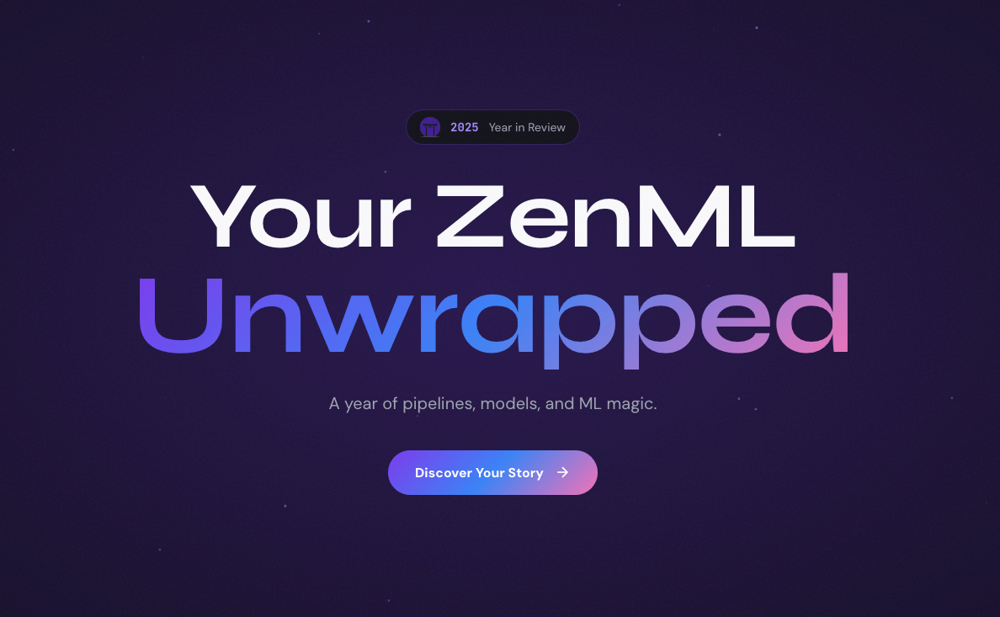

# ZenML Wrapped



Generate your team's personalized "Year in Review" for your ZenML project — see your pipeline stats, top contributors, fun awards, and more.

## Quick Start

### 1. Set up your environment

```bash
python -m venv .venv
source .venv/bin/activate  # On Windows: .venv\Scripts\activate
pip install -r requirements.txt
```

### 2. Connect to your ZenML workspace

```bash
zenml login
```

This will prompt you to select and authenticate with your ZenML server.

**Optional:** If you want metrics for a specific project (not the default), run:

```bash
zenml project set <your-project-name>
```

### 3. Extract your metrics

```bash
python extract_metrics.py
```

This generates `data/metrics.json` with all your 2025 pipeline data.

### 4. View your Wrapped

Serve the site locally:

**Using Python:**
```bash
python -m http.server 8000
```
Then open http://localhost:8000

**Using Node.js:**
```bash
npx serve .
```
Then open http://localhost:3000

## What You'll See

- **The Numbers** — Total runs, success rate, pipelines, artifacts, and models
- **Time Analytics** — Your busiest month, day, and hour
- **Top Pipelines** — Your most-run pipelines
- **Awards** — Fun recognition like "Pipeline Overlord", "Night Owl", "Weekend Warrior"
- **Team Stats** — Per-user breakdown with individual achievements
- **Fun Facts** — Personalized insights about your ML journey
